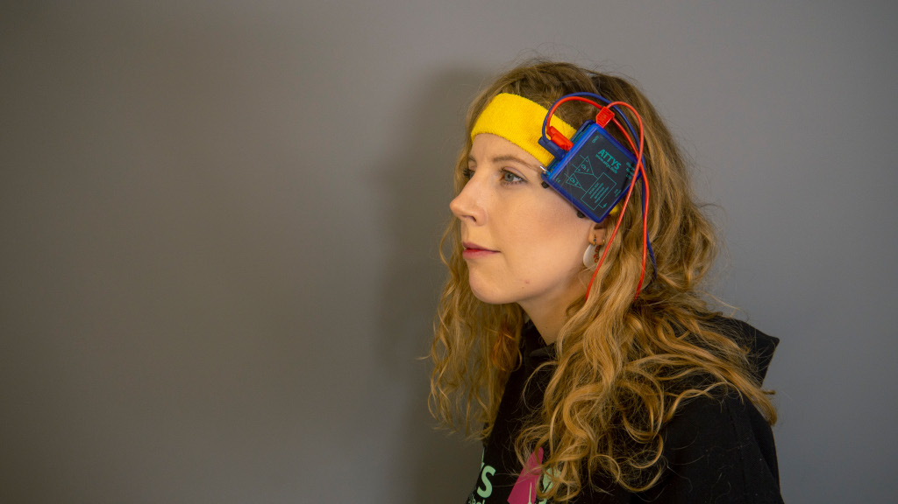

# attys-ep

Visually evoked potential app for [Attys](http://www.attys.tech)
for Windows/Linux


attys-ep performs averaging over repetitive stimuli. It
works on continous data such as visually evoked potentials and
also on discrete events such as spikes.

# Installation

## Linux

### Linux Ubuntu packages for xenial and bionic
Add these two repositories...
```
sudo add-apt-repository ppa:berndporr/attys
sudo add-apt-repository ppa:berndporr/dsp
```
...and then select `attys-ep` in your favourite package manager. This will then install also
the other required packages.

### Compilation from source

You need the following libraries to compile and run the program:

- AttysComm (https://github.com/glasgowneuro/AttysComm)
- Qt5 / Qwt (standard UBUNTU packages)
- IIR filter library (http://www.berndporr.me.uk/iir/)

Run "qmake", which generates a Makefile and "make" to compile
everything.

## Windows

### msi installer

https://github.com/glasgowneuro/attys-ep/blob/master/installer/Release/attys-ep-installer.msi

### Installation from source

* Install: Visual Studio 2017 community edition
* clone iir1 in your root directory: https://github.com/berndporr/iir1 and compile it (debug and release version)
* Download the open source version of QT5, 64 bits for visual C++ 2015/2017 from www.qt.io.
* Download Qwt from http://qwt.sf.net (the latest version 6.x), unpack it in the parent directory and compile it (as debug and release)
* git clone https://github.com/glasgowneuro/AttysComm.git in the parent directory or modify the .pro file
* Edit attys-ep and adjust the path variables so that AttysComm and IIR can be found
* "qmake -tp vc" and then re-target the project twice (right click on attys_scope in the Solutions Explorer -> Retarget Projects) 
* Open the .sln file
* Build attys-ep
* go to the "release" subdirectory
* copy qwt.dll into it
* run "windeployqt attys-ep.exe qwt.dll" which copies all the DLLs into this directory which are needed to run the app
* Build the msi installer which will be in the "installer" subdirectory.

## MacOS packages

### DMG

Download `attys-ep.dmg` and drop its contents in the applications folder.

### Homebrew

Install homebrew: https://brew.sh/

Add these two taps

```
brew tap berndporr/dsp
brew tap glasgowneuro/attys
```

and install attys-ep

```
brew install attys-ep
```


# Running attys-ep



Just type: "attys-ep" or start it from the applications menu.


# Credits

attys-ep is based in part on the work of the Qwt project (http://qwt.sf.net).
