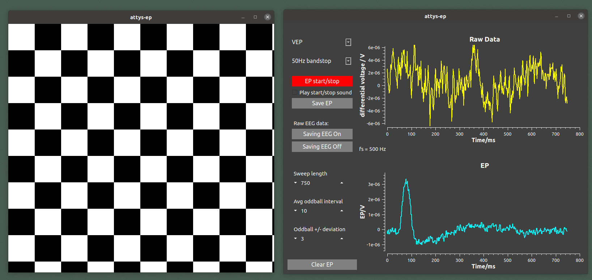

# attys-ep

Visually evoked potential app for [Attys](http://www.attys.tech)
for Windows/Linux

attys-ep performs averaging over repetitive stimuli. It
works on continous data such as visually evoked potentials and
also on discrete events such as spikes.

Attys-ep is based in part on the work of the Qwt project (http://qwt.sf.net)
which provides the QT widgets to visualise the data.

# Installation

## Linux

You need the following libraries to compile and run the program:

- AttysComm (https://github.com/glasgowneuro/AttysComm)
- Qt5 / Qwt (standard UBUNTU packages)
- IIR filter library (http://www.berndporr.me.uk/iir/)

Run "qmake", which generates a Makefile and "make" to compile
everything.

## Windows
* Install: Visual Studio 2017 community edition
* clone iir1 in your root directory: https://github.com/berndporr/iir1 and compile it (release version)
* Download the open source version of QT5, 64 bits for visual C++ 2015/2017 from www.qt.io:
  https://download.qt.io/official_releases/qt/5.7/5.7.0/qt-opensource-windows-x86-msvc2015_64-5.7.0.exe
* Download Qwt from http://qwt.sf.net (the latest version 6.x), unpack it in the parent directory and compile it (as release)
* git clone https://github.com/glasgowneuro/AttysComm.git in the parent directory or modify the .pro file
* "qmake -tp vc" and then re-target the project twice (right click on attys_scope in the Solutions Explorer -> Retarget Projects) 
* Open the .sln file
* Build solution

# Running attys-ep

Just type: "./attys-ep" or start it from the start menu under Windows.

